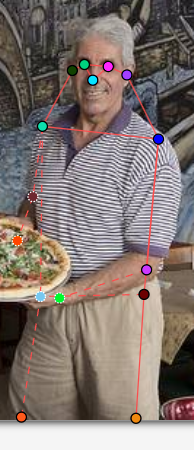
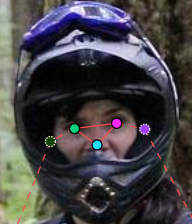
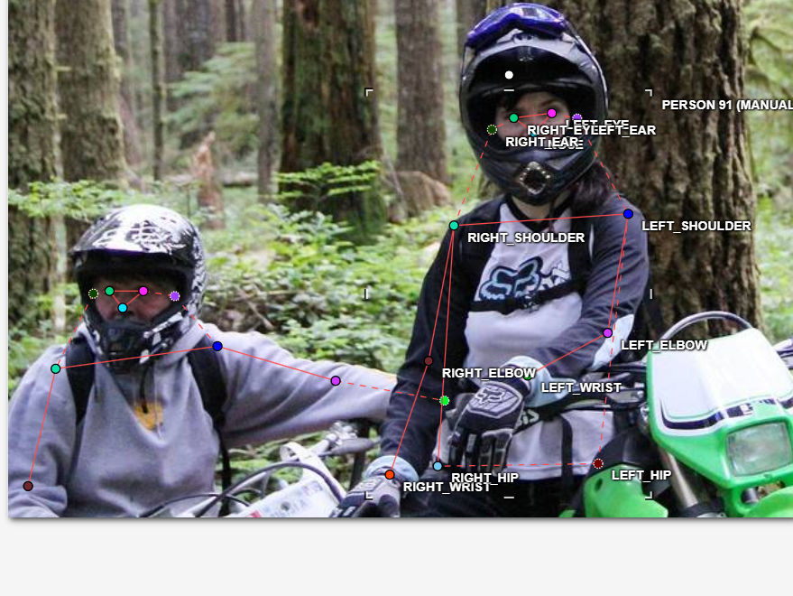
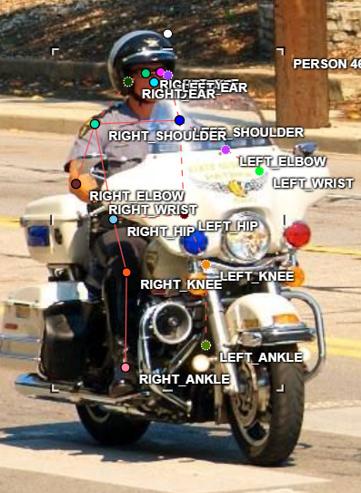
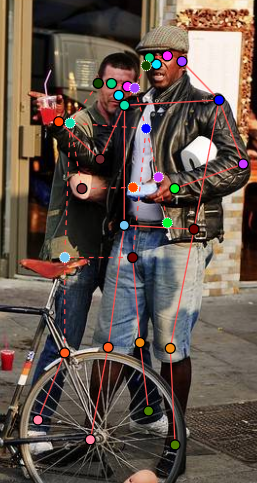
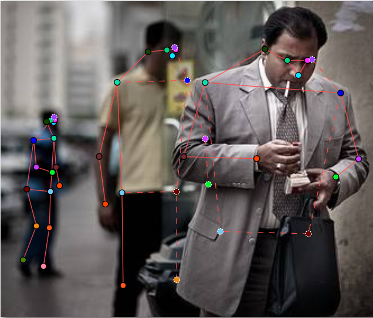

# Mini guideline - người gán: Lê Duy Phúc Lộc  |  ngày: 16/09/2026

> Điền file này **trong lúc** gán nhãn, không phải sau khi xong. Mỗi lần bạn dừng lại
> hơn 10 giây để phân vân, đó là một dòng phải ghi vào đây.

## 1. Luật bắt buộc (đã thống nhất cả lớp - không sửa)

- Bộ 17 điểm COCO, đúng tên, đúng thứ tự. Lấy từ file `.SVG` chung.
- Mọi người trong ảnh đều có **đủ 17 điểm**. Điểm không dùng được thì gắn cờ, không xoá.
- Trái/phải tính theo **cơ thể người**, không theo bức ảnh.
- Bị che, còn trong khung -> `v = 1`, **vẫn đặt chấm** ở vị trí ước lượng.
- Ra ngoài mép ảnh -> `v = 0`, **không** đặt chấm.
- Không dùng `Hidden` (`h`) - nó không được lưu vào file.

## 2. Luật của nhóm bạn (phải điền)

| Tình huống | Luật nhóm bạn chọn | Vì sao |
| --- | --- | --- |
| Hông của người mặc quần áo dài | Đặt điểm hông vào vị trí khớp giải phẫu ước lượng, không đặt vào mép hoặc nếp của quần áo. Nếu không nhìn thấy khớp nhưng người vẫn còn trong khung thì v = 1 và đặt tại vị trí ước lượng.  | Keypoint biểu diễn vị trí khớp cơ thể, không phải vị trí của bề mặt quần áo. |
| Tai bị tóc hoặc mũ bảo hiểm che một phần | Nếu vẫn xác định được vị trí tai tương đối rõ thì đặt keypoint tại vị trí tai và v = 1. Nếu bị che hoàn toàn nhưng vẫn còn trong khung thì vẫn ước lượng vị trí tai và giữ v = 1.  | Tuân thủ luật chung: vật thể bị che nhưng còn trong khung vẫn phải có keypoint. |
| Người bị cắt ở mép ảnh (chỉ thấy từ hông trở lên) | Các keypoint nằm ngoài ảnh: v = 0, không đặt chấm. Các keypoint còn nằm trong ảnh vẫn đặt bình thường.  | v = 0 dùng cho điểm nằm ngoài phạm vi ảnh, tránh đoán vị trí không quan sát được ngoài ảnh. |
| Cổ tay nằm sau tay lái / sau thân mình | Nếu cổ tay vẫn nằm trong khung ảnh nhưng bị che thì v = 1 và đặt tại vị trí ước lượng của khớp.  | Tay lái hoặc cơ thể người khác chỉ là vật che khuất; không được xoá keypoint. |
| Hai người chồng lên nhau | Gán riêng đủ 17 keypoint cho từng người. Với keypoint bị người còn lại che nhưng vẫn trong khung thì v = 1 và ước lượng vị trí. Không chuyển keypoint sang người đang che.  | Mỗi skeleton phải thuộc đúng một người, tránh trộn keypoint giữa hai người. |
| Người nhỏ đến mức nào thì không gán nữa | Không tự đặt ngưỡng bỏ người. Nếu người được xác định là người trong ảnh thì vẫn gán đủ 17 keypoint theo luật chung; keypoint không quan sát được thì xử lý bằng v = 1 hoặc v = 0 tùy trường hợp.  | Tránh việc mỗi người gán tự đặt một ngưỡng kích thước khác nhau, gây thiếu nhất quán dữ liệu. |

Với mỗi luật, chèn **một ảnh mẫu** (screenshot từ CVAT) thay vì chỉ viết một câu.
Slide 12 nói rõ: khớp không có bề mặt nhìn thấy được thì phải có ảnh mẫu, không phải
một câu văn chung chung.

## 3. Ba ca mơ hồ đã gặp (bắt buộc, ghi ít nhất 3)

Tôi không thấy trường hợp nào mơ hồ

## 4. Sau khi so visibility report với bạn cùng nhóm

- Khớp lệch `%v=1` nhiều nhất: `left_ear` (bạn `72%` / họ `___%`)
- Luật mới bổ sung vào mục 2 sau khi thống nhất: Đối với tai bị tóc, mũ bảo hiểm hoặc vật thể che: nếu vị trí tai vẫn nằm trong khung ảnh thì đặt keypoint tại vị trí tai ước lượng và gán v = 1; chỉ gán v = 0 khi vị trí tai nằm ngoài mép ảnh.
